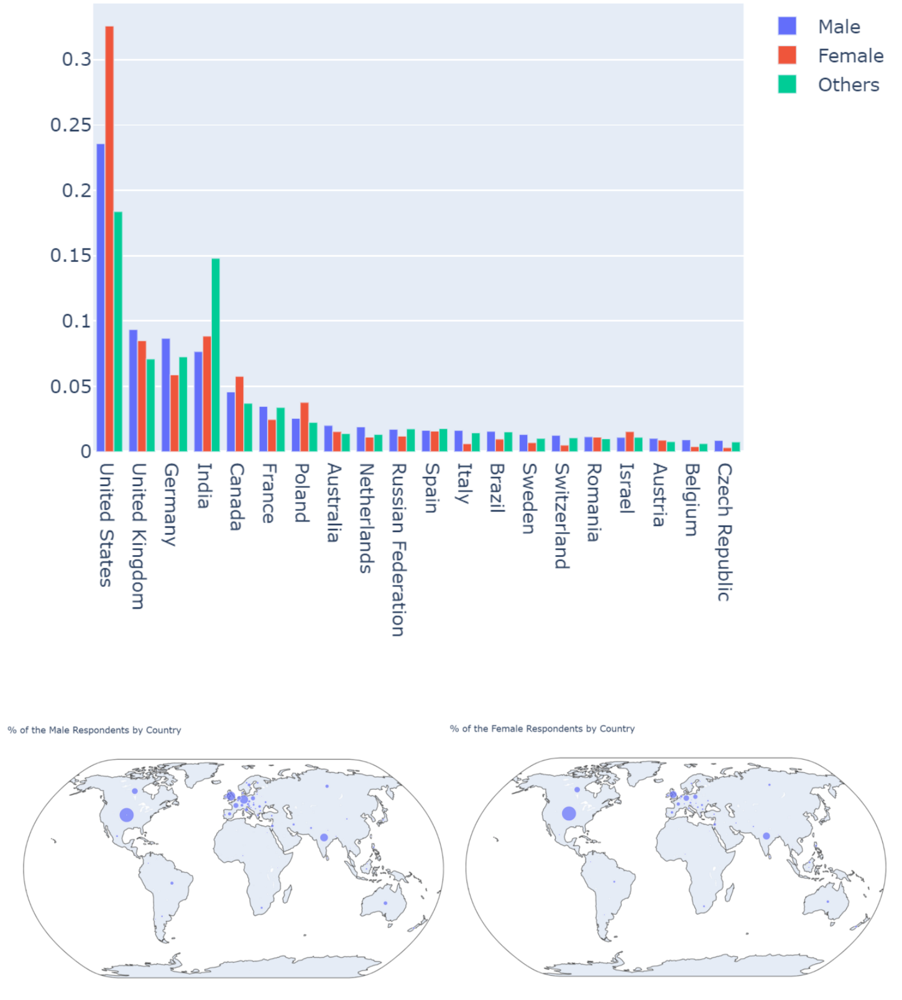

# Data Scientist Survey Analysis - README

## Installation
Run the command below to install all the requirements
pip install -r requirements.txt

Content of requirements.txt

## Project Motivation
The motivation behind this analysis is to better understand the developers' community using the respondents to Stack Overflow survey as a proxy. Consequently, we set out to answer the following questions:

1. Who is answering to Stack Overflow Survey? Are professionals or non-professionals using the site more?
1. Developers from which country/region are answering the survey?
1. Is there any gap between programming language that people want to learn and what they're using?
1. Is it true that developers have all been programming since childhood?

## File Descriptions
###Stackoverflow_survey_analysis.ipynb
All analysis is contained in the Jupyter notebook Stackoverflow_survey_analysis.ipynb.

### Data
To run this code, it is first necessary to download the 2017 Stack Overflow Develop Survey dataset from [here](https://www.kaggle.com/stackoverflow/so-survey-2017). Data (survey_results_public.csv and survey_results_schema.csv)should be saved in the same directory Stackoverflow_survey_analysis.ipynb is saved.

The data is made up of two files: 

1. survey_results_public.csv - CSV file with main survey results, one respondent per row and one column per answer
2. survey_results_schema.csv - CSV file with survey schema, i.e., the questions that correspond to each column name

## Results
The main findings of this analysis are summarised in a blog post available [here](https://medium.com/@yudaifurukawa/analysis-of-developers-community-using-stack-overflow-survey-2017-as-a-proxy-fdf92378079b).

## Licensing, Authors, Acknowledgements
The dataset used in this analysis was created by Stack Overflow and made available for download under the Open Database License (ODbL).

The code contained in this repository may be used freely with acknowledgement.